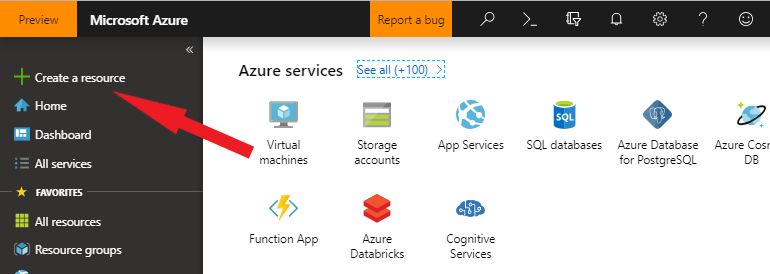
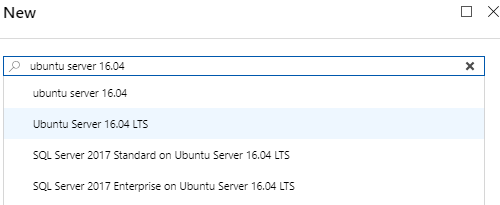

# Create Linux Virtual Machine - tutorial
## Introduction
This quick tutorial shows two different ways to create a virtual machine in Azure. In the first part, you will create a VM using the Azure Portal, and in the second step you will use the Azure CLI to achieve the same thing.

## Create VM using Azure Portal
Azure virtual machines (VMs) can be easily created through the Azure portal. The Azure portal is a browser-based user interface to create VMs and their associated resources. This quickstart shows you how to use the Azure portal to deploy a Linux virtual machine (VM) running Ubuntu 16.04 LTS. To see your VM in action, you also SSH to the VM and install the NGINX web server.

If you don't have an Azure subscription, create a free account before you begin.

## Sign in to Azure
The first step is to sign into the portal.

## Create virtual machine
* Choose Create a resource in the upper left corner of the Azure portal:

  

 

* In the search box above the list of Azure Marketplace resources, search for and select Ubuntu Server 16.04 LTS, then choose Create.

  

 

* In the Basics tab, under Project details, make sure the correct subscription is selected and then choose to Create new under Resource group. In the pop-up, type myResourceGroup for the name of the resource group and then choose OK.

  

 

* Under Instance details, type myVM for the Virtual machine name and choose West Europe for your Region. Leave the other defaults

  

 

* Under Administrator account, select Password, type your user name, then a password that fullfils the criteria (you will notice if it is accepted)

  

 

* Under Inbound port rules > Public inbound ports, choose Allow selected ports and then select SSH (22) and HTTP (80) from the drop-down. SSH (port 22) is needed for a later step, when you will access the virtual machine using ssh to start a web server. Port 80 is needed when you access that web page from your browser.

  

 

* Leave the remaining defaults and then select the Review + create button at the bottom of the page.
 

* On the Create a virtual machine page, you can see the details about the VM you are about to create. When you are ready, select Create.
