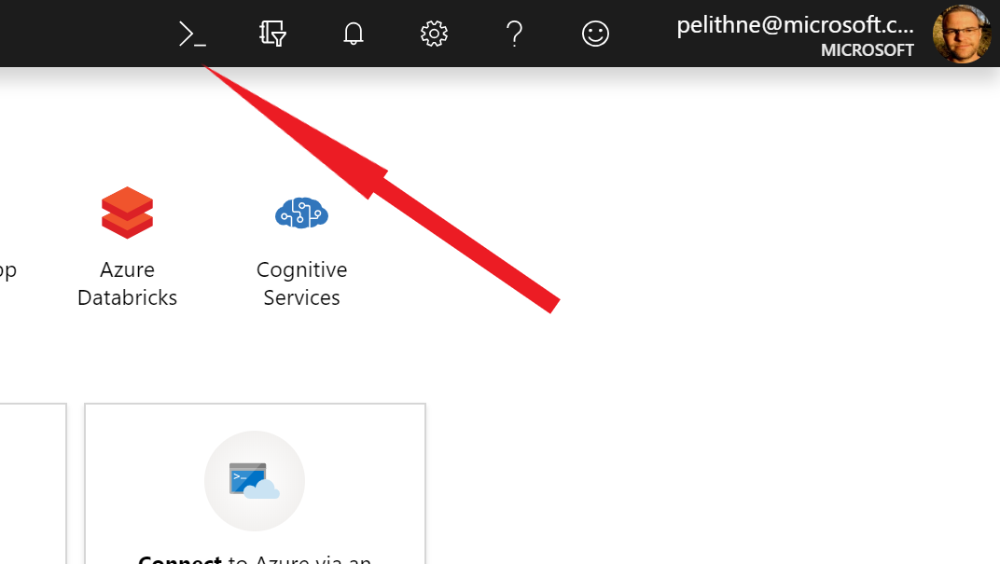

# Create VM with Azure CLI, using Cloud Shell

## Introduction
The Azure CLI is used to create and manage Azure resources from the command line or in scripts. This tutorial shows you how to use the Azure CLI to deploy a Linux virtual machine with Ubuntu 16.04 LTS. Like in the previous tutorial, you will also connect to it using SSH and install the NGINX web server.

If you don't have an Azure subscription, create a free account before you begin.

## Launch Azure Cloud Shell
The Azure Cloud Shell is a free interactive shell that you can use to run the steps in this article. You can of course use a shell on your local computer as well, but since the Azure Cloud Shell comes pre installed with all needed Azure tools and is configured to be used from your account, it is a convenient choice.

To open the Cloud Shell, just select Try it from the upper right corner of a code block. This will open up a shell in your browser. Select **bash** as the type of shell to use.
<p align="left">
  
</p>
<br>

You can also launch Cloud Shell in a separate browser tab by going to https://shell.azure.com/bash. 

## Create a resource group
Create a resource group with the az group create command. An Azure resource group is a logical container into which Azure resources are deployed and managed. The following example creates a resource group named **myResourceGroup2** in the **westeurope** location:

```console
az group create --name myResourceGroup2 --location westeurope
```

## Create virtual machine
Create a VM with the az vm create command.

The following example creates a VM named myVM2 and adds a user account named azureuser. 

## TODO: change to password
The --generate-ssh-keys parameter is used to automatically generate an SSH key, and put it in the default key location (~/.ssh). To use a specific set of keys instead, use the --ssh-key-value option.

```console
az vm create \
  --resource-group myResourceGroup2 \
  --name myVM2 \
  --image UbuntuLTS \
  --admin-username azureuser \
  --generate-ssh-keys
  ```
  
It takes a few minutes to create the VM and supporting resources. The following example output shows the VM create operation was successful.
````console
{
  "fqdns": "",
  "id": "/subscriptions/<guid>/resourceGroups/myResourceGroup/providers/Microsoft.Compute/virtualMachines/myVM",
  "location": "westeurope",
  "macAddress": "00-0D-3A-23-9A-49",
  "powerState": "VM running",
  "privateIpAddress": "10.0.0.4",
  "publicIpAddress": "40.68.254.142",
  "resourceGroup": "myResourceGroup"
}
````

Note your own publicIpAddress in the output from your VM. This address is used to access the VM in the next steps.

## Open port 80 for web traffic
By default, only SSH connections are opened when you create a Linux VM in Azure. Use az vm open-port to open TCP port 80 for use with the NGINX web server:

````console
az vm open-port --port 80 --resource-group myResourceGroup2 --name myVM2
````

## Connect to virtual machine
SSH to your VM as normal. Replace publicIpAddress with the public IP address of your VM as noted in the previous output from your VM:

````console
ssh azureuser@publicIpAddress
````


## Install web server
To see your VM in action, install the NGINX web server. Update your package sources and then install the latest NGINX package.

````console
sudo apt-get -y update
sudo apt-get -y install nginx
````

When done, type exit to leave the SSH session.

## View the web server in action
Use a web browser of your choice to view the default NGINX welcome page. Use the public IP address of your VM as the web address. The following example shows the default NGINX web site:
