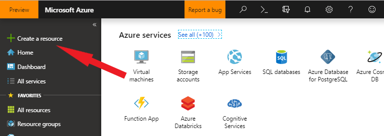
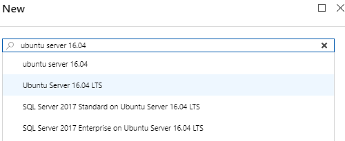
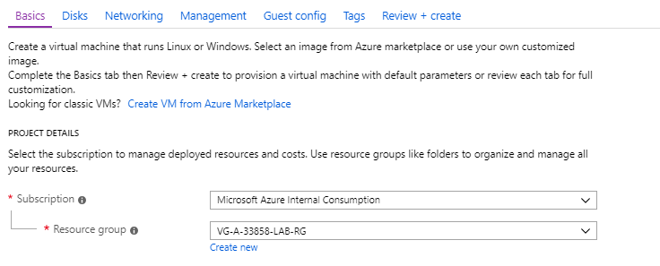
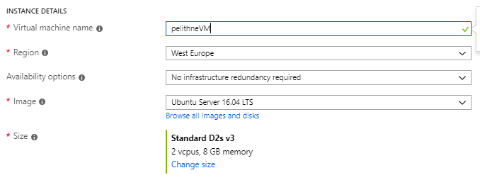
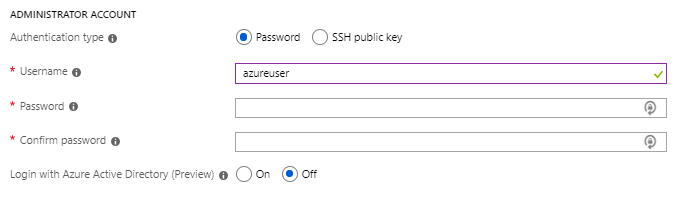
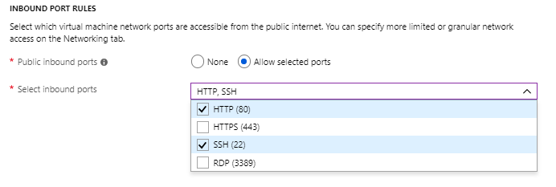
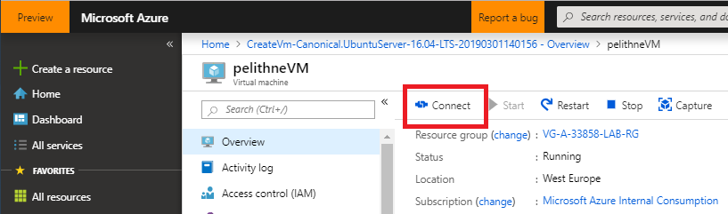

# Create Linux Virtual Machine - tutorial
## Introduction
This quick tutorial shows how to create a virtual machine in Azure using the Azure Portal.

## Create VM using Azure Portal
Azure virtual machines (VMs) can be easily created through the Azure portal. The Azure portal is a browser-based user interface to create VMs and their associated resources. This quickstart shows you how to use the Azure portal to deploy a Linux virtual machine (VM) running (for example) Ubuntu 16.04 LTS. To see your VM in action, you also SSH to the VM and install the NGINX web server.

## Sign in to Azure
The first step is to sign into the portal, using your azure account.

## Create virtual machine
* Choose Create a resource in the upper left corner of the Azure portal:

<p align="left">
  
</p>
<br>

* In the search box above the list of Azure Marketplace resources, search for and select Ubuntu Server 16.04 LTS (or any ubuntu release you feel like using), then choose Create.
<p align="left">
  
</p>
<br>


* In the Basics tab, under Project details, make sure the correct subscription is selected and then choose the resource group **VG-A-33858-LAB-RG**

### Note: The resourse group ````VG-A-33858-LAB-RG````has been created for the purpose of this workshop, and will be used by everyone. 
<p align="left">
  
</p>
<br>

* Under Instance details, give the Virtual machine a unique name name (e.g. using your corporate signum) and choose West Europe for your Region. Leave the other defaults
<p align="left">
  
</p>
<br>

* Under Administrator account, select Password, type your user name, then a password that fullfils the criteria (you will be informed if it is accepted or not)
<p align="left">
  
</p>
<br>

* Under Inbound port rules > Public inbound ports, choose Allow selected ports and then select SSH (22) and HTTP (80) from the drop-down. SSH (port 22) is needed for a later step, when you will access the virtual machine using ssh to start a web server. Port 80 is needed when you access that web page from your browser.
<p align="left">
  
</p>
<br>

* Leave the remaining defaults and then select the Review + create button at the bottom of the page.
<br>

* On the Create a virtual machine page, you can see the details about the VM you are about to create. When you are ready, select Create.


### Connect to virtual machine
In this step you will create an SSH connection with the VM. Select the Connect button on the overview page for your VM.
<p align="left">
  
</p>
<br>


In the Connect to virtual machine page, keep the default options to connect by IP address over port 22. In Login using VM local account a connection command is shown. The following example shows what the SSH connection command looks like:
```console
ssh azureuser@10.111.12.123
```

### Install web server
To see your VM in action, install an NGINX web server. From your SSH session, update your package sources and then install the latest NGINX package.
```console
sudo apt-get -y update
sudo apt-get -y install nginx
```

### View the web server in action
Use a web browser of your choice to view the default NGINX welcome page. Enter the public IP address of the VM as the web address. The public IP address can be found on the VM overview page or as part of the SSH connection string you used earlier.
<p align="left">
  
</p>


## Nest step
The next step is to do the same thing again (whoho!) but using the Azure CLI! Click <a href="https://github.com/pelithne/azure-workshop/blob/master/create-vm-azcli.md">here</a> to continue.
