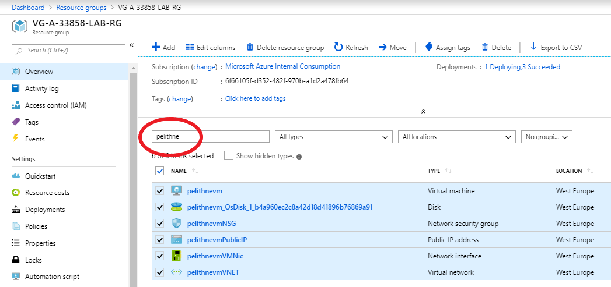

# Create VM with Customized configuration

This tutorial goes into how to add configuration to a VM at boot time, how to scale VMs and how to loadbalance traffic to a set of VMS.

## Custom configuration using cloud-init
This part of the tutorial explains how to configure a VM using cloud-init. 

In a previous tutorial you created a VM, then logged in with ssh and installed nginx. In order to streamline this, some level of automation is desirable. A first step in this direction can be to use **cloud-init** to configure the VM.

**Cloud-init** is a widely used approach to customize a Linux VM as it boots for the first time. You can use cloud-init to install packages and write files, or to configure users and security. As cloud-init runs during the initial boot process, there are no additional steps or required agents to apply your configuration.

Cloud-init also works across distributions. For example, you don't use apt-get install or yum install to install a package. Instead you can define a list of packages to install. Cloud-init automatically uses the native package management tool for the distro you select.

### Create cloud-init config file
To see cloud-init in action, create a VM that installs NGINX and runs a simple 'Hello World' Node.js app. The following cloud-init configuration installs the required packages, creates a Node.js app, then initialize and starts the app.

In your current shell, create a file named cloud-init.txt and paste the following configuration. For example, create the file in the Cloud Shell not on your local machine. You can use any editor you wish. Enter ````code cloud-init.txt```` to use **Visual Studio Code** from the cloud shell. If you prefer to use **Vim** or **Nano** you can use that instead. Either way, make sure that the whole cloud-init file is copied correctly, including the first line:

````yaml
#cloud-config
package_upgrade: true
packages:
  - nginx
  - nodejs
  - npm
write_files:
  - owner: www-data:www-data
    path: /etc/nginx/sites-available/default
    content: |
      server {
        listen 80;
        location / {
          proxy_pass http://localhost:3000;
          proxy_http_version 1.1;
          proxy_set_header Upgrade $http_upgrade;
          proxy_set_header Connection keep-alive;
          proxy_set_header Host $host;
          proxy_cache_bypass $http_upgrade;
        }
      }
  - owner: azureuser:azureuser
    path: /home/azureuser/myapp/index.js
    content: |
      var express = require('express')
      var app = express()
      var os = require('os');
      app.get('/', function (req, res) {
        res.send('Hello World from host ' + os.hostname() + '!')
      })
      app.listen(3000, function () {
        console.log('Hello world app listening on port 3000!')
      })
runcmd:
  - service nginx restart
  - cd "/home/azureuser/myapp"
  - npm init
  - npm install express -y
  - nodejs index.js
````

### Create virtual machine
This time, when you create the VM, you will pass your newly created cloud-init.txt file to the ````az vm create```` command. Also, this time around, we will not use a password, and instead let **az cli** create an ssh key for us. Finally, we use Ubuntu 14.04:latest as the base image for the VM. Other than that, the procedure is the same as before (make sure to use your own unique name for the VM)
````console
az vm create --resource-group  VG-A-33858-LAB-RG --name pelithnevm --admin-username azureuser --generate-ssh-keys --size Standard_B1s --custom-data cloud-init.txt
````

It takes a few minutes for the VM to be created, the packages to install, and the app to start. There are background tasks that continue to run after the Azure CLI returns you to the prompt. It may be another couple of minutes before you can access the app. When the VM has been created, take note of the ````publicIpAddress```` displayed by the Azure CLI. This address is used to access the Node.js app via a web browser.

### Open port 80 for web traffic
To allow web traffic to reach your VM, open port 80 from the Internet with ````az vm open-port```` (remember to substitue **pelithnevm** with your own vm name):
````console
az vm open-port --port 80 --resource-group VG-A-33858-LAB-RG --name pelithnevm
````

### Test web app
Now you can open a web browser and enter http:// in the address bar. Provide your own public IP address from the VM create process. Your Node.js app is displayed as shown in the following example:

## Clean-up
To make sure we don't use unnecessary resources, and to keep things clean, you should remove all the resources created in this step. One way of doing that is to got to the resource group blade, and filter on the unique name you assigned to the VM:

<p align="left">
  
</p>

Now you can check the boxes next to your resources, and then click delete (in the upper right part of the window).

## Next step
Next step is to configure loadbalancing. This involves bringing up tow Virtual Machines, and to deploy a load balancer infront of those VMs to distribute traffic between them. Please <a href="https://github.com/pelithne/azure-workshop/blob/master/loadbalancing.md">here</a> to continue.
