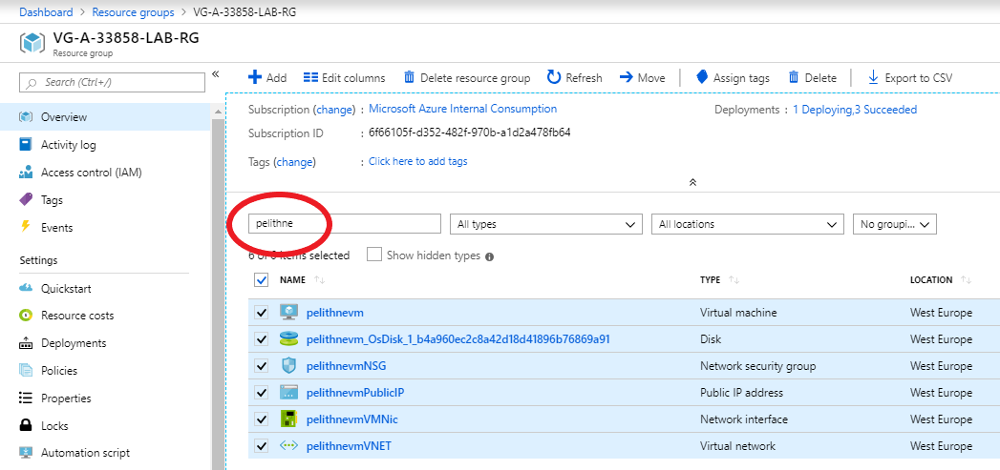

# Load balance Linux virtual machines in Azure to create a highly available application

## Introduction
Load balancing provides a higher level of availability by spreading incoming requests across multiple virtual machines. In this tutorial, you learn about the different components of the Azure load balancer that distribute traffic and provide high availability. 

## Azure load balancer overview
An Azure load balancer is a Layer-4 (TCP, UDP) load balancer that provides high availability by distributing incoming traffic among a set of VMs.

You define a front-end IP configuration that contains one or more public IP addresses. This front-end IP configuration allows your load balancer and applications to be accessible over the Internet.

Virtual machines connect to a load balancer using their virtual network interface card (NIC). To distribute traffic to the VMs, a back-end address pool contains the IP addresses of the virtual (NICs) connected to the load balancer.

To control the flow of traffic, you define load balancer rules for specific ports and protocols that map to your VMs.

### Create a public IP address
To access your app on the Internet, you need a public IP address for the load balancer. Create a public IP address with ````az network public-ip create````. The following example creates a public IP address named pelithneIP in the VG-A-33858-LAB-RG resource group. 

### note: give the public ip a unique name, e.g. by using your corporate signum. This is important, since you are all working in the same Resource Group.

````console
az network public-ip create --resource-group VG-A-33858-LAB-RG --name pelithneIP
 ````
 
### Create a load balancer
Create a load balancer with ````az network lb create````. The following example creates a load balancer named pelithneLB and assigns the newly created IP address to the front-end IP configuration.

### note: give the resources unique names, e.g. by using your corporate signum.

````console
az network lb create --resource-group VG-A-33858-LAB-RG --name pelithneLB --frontend-ip-name pelithneFEP --backend-pool-name pelithneBEP --public-ip-address pelithneIP
````

### Create a load balancer rule
A load balancer rule is used to define how traffic is distributed to the VMs. You define the front-end IP configuration for the incoming traffic and the back-end IP pool to receive the traffic, along with the required source and destination port. 

Create a load balancer rule with ````az network lb rule create````. The following example creates a rule named pelithneLBRule, uses the myHealthProbe health probe, and balances traffic on port 80:

### note: give the LB Rule a unique name, e.g. by using your corporate signum.

````console
az network lb rule create --resource-group VG-A-33858-LAB-RG --lb-name pelithneLB --name pelithneLBRule --protocol tcp --frontend-port 80 --backend-port 80 --frontend-ip-name pelithneFEP --backend-pool-name pelithneBEP 
````

This command may take some time to complete, so have patience...

## Configure virtual network
Before you deploy some VMs and can test your balancer, create the supporting virtual network resources. 

### Create network resources
Create a virtual network with ````az network vnet create````. The following example creates a virtual network named pelithneVnet with a subnet named pelithneSubnet:

### note: give the resources unique names, e.g. by using your corporate signum.

````console
az network vnet create --resource-group VG-A-33858-LAB-RG --name pelithneVnet --subnet-name pelithneSubnet
````

To add a network security group, you use ````az network nsg create````. The following example creates a network security group named pelithneNSG.

### note: give the nsg a unique name, e.g. by using your corporate signum. 
````console
az network nsg create --resource-group VG-A-33858-LAB-RG --name pelithneNSG
````

Create a network security group rule with ````az network nsg rule create````. The following example creates a network security group rule named pelithneNSGRule:

````console
az network nsg rule create --resource-group VG-A-33858-LAB-RG --nsg-name pelithneNSG --name pelithneNSGRule --priority 1001 --protocol tcp --destination-port-range 80
````

Virtual NICs are created with az network nic create. The following example creates three virtual NICs. (One virtual NIC for each VM you create for your app in the following steps). You can create additional virtual NICs and VMs at any time and add them to the load balancer. You can of course do this without the for loop, and instead name the NICs manually

#### note: As always, give the resources unique names, e.g. by using your corporate signum. 

#### protip: Copy the text below to a text editor and change it, before pasting into cloud shell

````console
for i in `seq 1 3`; do
    az network nic create \
        --resource-group VG-A-33858-LAB-RG \
        --name pelithneNic$i \
        --vnet-name pelithneVnet \
        --subnet pelithneSubnet \
        --network-security-group pelithneNSG \
        --lb-name pelithneLB \
        --lb-address-pools pelithneBEP
done
````

## Virtual Machines
In a previous tutorial on how to customize a Linux virtual machine on first boot, you learned how to automate VM customization with cloud-init. You can use the same cloud-init configuration file to install NGINX and run a simple 'Hello World' Node.js app in the next step. To see the load balancer in action, at the end of the tutorial you access this simple app in a web browser.

If you did not already create a **cloud-init** file, you can create one now e.g. using the VS Code extenstion to the cloud shell:

````console
code cloud-init.txt
````
Then paste the folling into the file and save (right click in the text editor "window" and select **save**)

````
#cloud-config
package_upgrade: true
packages:
  - nginx
  - nodejs
  - npm
write_files:
  - owner: www-data:www-data
  - path: /etc/nginx/sites-available/default
    content: |
      server {
        listen 80;
        location / {
          proxy_pass http://localhost:3000;
          proxy_http_version 1.1;
          proxy_set_header Upgrade $http_upgrade;
          proxy_set_header Connection keep-alive;
          proxy_set_header Host $host;
          proxy_cache_bypass $http_upgrade;
        }
      }
  - owner: azureuser:azureuser
  - path: /home/azureuser/myapp/index.js
    content: |
      var express = require('express')
      var app = express()
      var os = require('os');
      app.get('/', function (req, res) {
        res.send('Hello World from host ' + os.hostname() + '!')
      })
      app.listen(3000, function () {
        console.log('Hello world app listening on port 3000!')
      })
runcmd:
  - service nginx restart
  - cd "/home/azureuser/myapp"
  - npm init
  - npm install express -y
  - nodejs index.js
````

### Create Availability Set
To improve the high availability of your app, place your VMs in an availability set. 

Create an availability set with ````az vm availability-set create````. The following example creates an availability set named pelithneAS:

````
az vm availability-set create --resource-group VG-A-33858-LAB-RG --name pelithneAS
````

### Create VMs
Now you can create the VMs with ````az vm create````. The following example creates three VMs and generates SSH keys if they do not already exist. Once again, you can create the VMs without the for loop. If so, make sure to assign unique NICs to each VM.

### note: Give the resources unique names, e.g. by using your corporate signum. 

````
for i in `seq 1 3`; do
    az vm create \
        --resource-group VG-A-33858-LAB-RG \
        --name pelithneVM$i \
        --availability-set pelithneAS \
        --nics pelithneNic$i \
        --image UbuntuLTS \
        --admin-username azureuser \
        --generate-ssh-keys \
        --size Standard_B1s \
        --custom-data cloud-init.txt \
        --no-wait
done
````

There are background tasks that continue to run after the Azure CLI returns you to the prompt. The --no-wait parameter does not wait for all the tasks to complete. It may be another couple of minutes before you can access the app.

## Test the Load Balancer
Obtain the public IP address of your load balancer with ````az network public-ip show````. The following example obtains the IP address for the public IP address created earlier:

````
az network public-ip show --resource-group VG-A-33858-LAB-RG --name pelithneIP --query [ipAddress] --output tsv
````
You can then enter the public IP address in to a web browser. Remember - it takes a few minutes for the VMs to be ready before the load balancer starts to distribute traffic to them. The app is displayed, including the hostname of the VM that the load balancer distributed traffic to as in the following example:

<p align="left">
  
</p>
<br>

If you open up the same page in another browser window (even better in a different browser), you should see that a different VM is selected by the Load Balancer. If not, try again.

<p align="left">
  
</p>
<br>

## Clean-up
To make sure we don't use unnecessary resources, and to keep things clean, you should remove all the resources created in this step. One way of doing that is to go to the **Resource Group** blade, and filter on the unique name you assigned to the VM. This will match all the resources that were created together with the VM.

<p align="left">
  
</p>

Now you can check the boxes next to your resources, and then click delete (in the upper right part of the window).

## Next step
Next step is to set up a VM Scale Set, to create an automatically scaling application. Click <a href="https://github.com/pelithne/azure-workshop/blob/master/vm-scale-sets.md">here</a> to continue.
