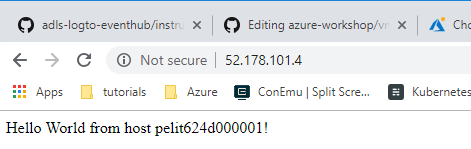

# Create a virtual machine scale set and deploy a highly available app on Linux 

A virtual machine scale set allows you to deploy and manage a set of identical, auto-scaling virtual machines. You can scale the number of VMs in the scale set manually, or define rules to autoscale based on resource usage such as CPU, memory demand, or network traffic. In this tutorial, you deploy a virtual machine scale set in Azure. 

## Scale Set overview
VMs in a scale set are distributed across logic fault and update domains in one or more **placement groups**. These are groups of similarly configured VMs, similar to availability sets.

VMs are created as needed in a scale set. You define autoscale rules to control how and when VMs are added or removed from the scale set. These rules can be triggered based on metrics such as CPU load, memory usage, or network traffic.

Scale sets support up to 1,000 VMs when you use an Azure platform image. For workloads with significant installation or VM customization requirements, you may wish to Create a custom VM image. You can create up to 300 VMs in a scale set when using a custom image.

## Create an app to scale
In a previous tutorial, you learned how to customize a Linux virtual machine on first boot with cloud-init. You can use the same cloud-init configuration file to install NGINX and run a simple 'Hello World' Node.js app.

If you did not already create a **cloud-init** file, you can create one now e.g. using the VS Code extenstion to the cloud shell:

````console
code cloud-init.txt
````
Then paste the folling into the file and save (right click in the text editor "window" and select **save**)

````
#cloud-config
package_upgrade: true
packages:
  - nginx
  - nodejs
  - npm
write_files:
  - owner: www-data:www-data
  - path: /etc/nginx/sites-available/default
    content: |
      server {
        listen 80;
        location / {
          proxy_pass http://localhost:3000;
          proxy_http_version 1.1;
          proxy_set_header Upgrade $http_upgrade;
          proxy_set_header Connection keep-alive;
          proxy_set_header Host $host;
          proxy_cache_bypass $http_upgrade;
        }
      }
  - owner: azureuser:azureuser
  - path: /home/azureuser/myapp/index.js
    content: |
      var express = require('express')
      var app = express()
      var os = require('os');
      app.get('/', function (req, res) {
        res.send('Hello World from host ' + os.hostname() + '!')
      })
      app.listen(3000, function () {
        console.log('Hello world app listening on port 3000!')
      })
runcmd:
  - service nginx restart
  - cd "/home/azureuser/myapp"
  - npm init
  - npm install express -y
  - nodejs index.js
````

## Create a scale set

Create a virtual machine scale set with ````az vmss create````. The following example creates a scale set named pelithneScaleSet, uses the cloud-init file to customize the VM, and generates SSH keys if they do not exist.

### note: give the resources unique names, e.g. by using your corporate signum.

````console
az vmss create --resource-group VG-A-33858-LAB-RG --name pelithneScaleSet --image UbuntuLTS --upgrade-policy-mode automatic --custom-data cloud-init.txt --admin-username azureuser --vm-sku Standard_B1s --generate-ssh-keys
````
It takes a few minutes to create and configure all the scale set resources and VMs. There are background tasks that continue to run after the Azure CLI returns you to the prompt. It may be another couple of minutes before you can access the app.

## Allow web traffic
**A load balancer is created automatically as part of the virtual machine scale set**. The load balancer distributes traffic across a set of defined VMs using load balancer rules. 

To allow traffic to reach the web app, create a rule with ````az network lb rule create````. The following example creates a rule named pelithneLBRuleWeb:

### note: give the resources unique names, e.g. by using your corporate signum.

````
az network lb rule create --resource-group VG-A-33858-LAB-RG --name pelithneLBRuleWeb --lb-name pelithneScaleSetLB --backend-pool-name pelithneScaleSetLBBEPool --backend-port 80 --frontend-ip-name loadBalancerFrontEnd --frontend-port 80 --protocol tcp
````
This may take a while... patience!

## Test your app
To see your Node.js app on the web, obtain the public IP address of your load balancer with ````az network public-ip show````. The following example obtains the IP address for pelithneScaleSetLBPublicIP created as part of the scale set:

````
az network public-ip show --resource-group VG-A-33858-LAB-RG --name pelithneScaleSetLBPublicIP --query [ipAddress] --output tsv
````

In the browser, you should se something similar to:
<p align="left">
  
</p>
<br>


## Management tasks
Throughout the lifecycle of the scale set, you may need to run one or more management tasks. Additionally, you may want to create scripts that automate various lifecycle-tasks. The Azure CLI provides a quick way to do those tasks. Here are a few common tasks.

### View VMs in a scale set
To view a list of VMs running in your scale set, use ````az vmss list-instances```` as follows:

````
az vmss list-instances --resource-group VG-A-33858-LAB-RG --name pelithneScaleSet --output table
````

### Manually increase or decrease VM instances
To see the number of instances you currently have in a scale set, use ````az vmss show and query```` on sku.capacity:

````
az vmss show --resource-group VG-A-33858-LAB-RG --name pelithneScaleSet --query [sku.capacity] --output table
````
You can then manually increase or decrease the number of virtual machines in the scale set with ````az vmss scale````. The following example sets the number of VMs in your scale set to 3.

### note: give the resources unique names, e.g. by using your corporate signum.

````
az vmss scale --resource-group VG-A-33858-LAB-RG --name pelithneScaleSet --new-capacity 3
````

When the command returns, you can check once again the number of VMs in the scale set:

````
az vmss show --resource-group VG-A-33858-LAB-RG --name pelithneScaleSet --query [sku.capacity] --output table
````
 
    
    

