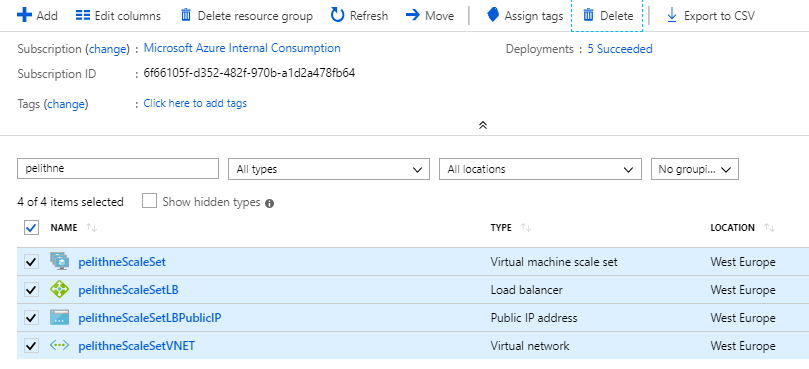

# Create a virtual machine scale set and deploy a highly available app on Linux 

A virtual machine scale set allows you to deploy and manage a set of identical, auto-scaling virtual machines. You can scale the number of VMs in the scale set manually, or define rules to autoscale based on resource usage such as CPU, memory demand, or network traffic. In this tutorial, you deploy a virtual machine scale set in Azure. 

## Scale Set overview
VMs in a scale set are distributed across logic fault and update domains in one or more **placement groups**. These are groups of similarly configured VMs, similar to availability sets.

VMs are created as needed in a scale set. You define autoscale rules to control how and when VMs are added or removed from the scale set. These rules can be triggered based on metrics such as CPU load, memory usage, or network traffic.

Scale sets support up to 1,000 VMs when you use an Azure platform image. For workloads with significant installation or VM customization requirements, you may wish to Create a custom VM image. You can create up to 300 VMs in a scale set when using a custom image.

## Create an app to scale
In a previous tutorial, you learned how to customize a Linux virtual machine on first boot with cloud-init. You can use the same cloud-init configuration file to install NGINX and run a simple 'Hello World' Node.js app.

If you did not already create a **cloud-init** file, you can create one now e.g. using the VS Code extenstion to the cloud shell:

````console
code cloud-init.txt
````
Then paste the folling into the file and save (right click in the text editor "window" and select **save**)

````
#cloud-config
package_upgrade: true
packages:
  - nginx
  - nodejs
  - npm
write_files:
  - owner: www-data:www-data
  - path: /etc/nginx/sites-available/default
    content: |
      server {
        listen 80;
        location / {
          proxy_pass http://localhost:3000;
          proxy_http_version 1.1;
          proxy_set_header Upgrade $http_upgrade;
          proxy_set_header Connection keep-alive;
          proxy_set_header Host $host;
          proxy_cache_bypass $http_upgrade;
        }
      }
  - owner: azureuser:azureuser
  - path: /home/azureuser/myapp/index.js
    content: |
      var express = require('express')
      var app = express()
      var os = require('os');
      app.get('/', function (req, res) {
        res.send('Hello World from host ' + os.hostname() + '!')
      })
      app.listen(3000, function () {
        console.log('Hello world app listening on port 3000!')
      })
runcmd:
  - service nginx restart
  - cd "/home/azureuser/myapp"
  - npm init
  - npm install express -y
  - nodejs index.js
````

## Create a scale set

Create a virtual machine scale set with ````az vmss create````. The following example creates a scale set named pelithneScaleSet, uses the cloud-init file to customize the VM, and generates SSH keys if they do not exist.

### note: give the resources unique names, e.g. by using your corporate signum.

````console
az vmss create --resource-group VG-A-33858-LAB-RG --name pelithneScaleSet --image UbuntuLTS --upgrade-policy-mode automatic --custom-data cloud-init.txt --admin-username azureuser --vm-sku Standard_B1s --generate-ssh-keys
````
It takes a few minutes to create and configure all the scale set resources and VMs. There are background tasks that continue to run after the Azure CLI returns you to the prompt. It may be another couple of minutes before you can access the app.

## Allow web traffic
**A load balancer is created automatically as part of the virtual machine scale set**. The load balancer distributes traffic across a set of defined VMs using load balancer rules. 

To allow traffic to reach the web app, create a rule with ````az network lb rule create````. The following example creates a rule named pelithneLBRuleWeb:

### note: give the resources unique names, e.g. by using your corporate signum.

````
az network lb rule create --resource-group VG-A-33858-LAB-RG --name pelithneLBRuleWeb --lb-name pelithneScaleSetLB --backend-pool-name pelithneScaleSetLBBEPool --backend-port 80 --frontend-ip-name loadBalancerFrontEnd --frontend-port 80 --protocol tcp
````
This may take a while... patience!

## Test your app
To see your Node.js app on the web, obtain the public IP address of your load balancer with ````az network public-ip show````. The following example obtains the IP address for pelithneScaleSetLBPublicIP created as part of the scale set:

````
az network public-ip show --resource-group VG-A-33858-LAB-RG --name pelithneScaleSetLBPublicIP --query [ipAddress] --output tsv
````

In the browser, you should se something similar to:
<p align="left">
  
</p>
<br>


## Management tasks
Throughout the lifecycle of the scale set, you may need to run one or more management tasks. Additionally, you may want to create scripts that automate various lifecycle-tasks. The Azure CLI provides a quick way to do those tasks. Here are a few common tasks.

### View VMs in a scale set
To view a list of VMs running in your scale set, use ````az vmss list-instances```` as follows:

````
az vmss list-instances --resource-group VG-A-33858-LAB-RG --name pelithneScaleSet --output table
````

### Manually increase or decrease VM instances
To see the number of instances you currently have in a scale set, use ````az vmss show and query```` on sku.capacity:

````
az vmss show --resource-group VG-A-33858-LAB-RG --name pelithneScaleSet --query [sku.capacity] --output table
````
You can then manually increase or decrease the number of virtual machines in the scale set with ````az vmss scale````. The following example sets the number of VMs in your scale set to 3.

#### note: give the resources unique names, e.g. by using your corporate signum.

````
az vmss scale --resource-group VG-A-33858-LAB-RG --name pelithneScaleSet --new-capacity 3
````

When the command returns, you can check once again the number of VMs in the scale set:

````
az vmss show --resource-group VG-A-33858-LAB-RG --name pelithneScaleSet --query [sku.capacity] --output table
````
 
## Automatically scale the VMs in the scale set
To enable autoscale on a scale set, you first define an autoscale profile. This profile defines the default, minimum, and maximum scale set capacity. These limits let you control cost by not continually creating VM instances, and balance acceptable performance with a minimum number of instances that remain in a scale-in event. Create an autoscale profile with az monitor autoscale create. The following example sets the default, and minimum, capacity of 2 VM instances, and a maximum of 10:

````
az monitor autoscale create --resource-group VG-A-33858-LAB-RG --resource pelithneScaleSet --resource-type Microsoft.Compute/virtualMachineScaleSets --name autoscale --min-count 2 --max-count 10 --count 2
````
### Create a rule to autoscale out
ou control what metrics to monitor, such as CPU or disk, how long the application load must meet a given threshold, and how many VM instances to add to the scale set.

Let's create a rule with az monitor autoscale rule create that increases the number of VM instances in a scale set when the average CPU load is greater than 70% over a 5-minute period. When the rule triggers, the number of VM instances is increased by three.

````
az monitor autoscale rule create --resource-group VG-A-33858-LAB-RG --autoscale-name pelithneAS --condition "Percentage CPU > 70 avg 5m" --scale out 3
````
    
### Create a rule to autoscale in
Create another rule with az monitor autoscale rule create that decreases the number of VM instances in a scale set when the average CPU load then drops below 30% over a 5-minute period. The following example defines the rule to scale in the number of VM instances by one:

````
az monitor autoscale rule create --resource-group VG-A-33858-LAB-RG --autoscale-name pelithneAS --condition "Percentage CPU < 30 avg 5m" --scale in 1
````
    
### Generate CPU load on scale set
To test the autoscale rules, generate some CPU load on the VM instances in the scale set. This simulated CPU load causes the autoscales to scale out and increase the number of VM instances. As the simulated CPU load is then decreased, the autoscale rules scale in and reduce the number of VM instances.

First, list the address and ports to connect to VM instances in a scale set with ````az vmss list-instance-connection-info````:
````
az vmss list-instance-connection-info --resource-group VG-A-33858-LAB-RG --name pelithneScaleSet
````
The following example output shows the instance name, public IP address of the load balancer, and port number that the Network Address Translation (NAT) rules forward traffic to:
````json
{
  "instance 1": "13.92.224.66:50001",
  "instance 3": "13.92.224.66:50003"
}
````
SSH to your first VM instance. Specify your own public IP address and port number with the -p parameter, as shown from the preceding command:
````
ssh azureuser@13.92.224.66 -p 50001
````

Once logged in, install the stress utility. Start 10 stress workers that generate CPU load. These workers run for 420 seconds, which is enough to cause the autoscale rules to implement the desired action.

````
sudo apt-get -y install stress
sudo stress --cpu 10 --timeout 420 &
````

When stress shows output similar to stress: info: [2688] dispatching hogs: 10 cpu, 0 io, 0 vm, 0 hdd, press the Enter key to return to the prompt.

To confirm that stress generates CPU load, examine the active system load with the top utility:

````
top
````
Exit top, then close your connection to the VM instance. stress continues to run on the VM instance.
````
Ctrl-c
exit
````
Connect to second VM instance with the port number listed from the previous az vmss list-instance-connection-info:
````
ssh azureuser@13.92.224.66 -p 50003
````

Install and run stress, then start ten workers on this second VM instance.
````
sudo apt-get -y install stress
sudo stress --cpu 10 --timeout 420 &
````
Again, when stress shows output similar to stress: info: [2713] dispatching hogs: 10 cpu, 0 io, 0 vm, 0 hdd, press the Enter key to return to the prompt.

Close your connection to the second VM instance. stress continues to run on the VM instance.
````
exit
````

### Monitor the active autoscale rules
To monitor the number of VM instances in your scale set, use **watch**. It takes 5 minutes for the autoscale rules to begin the scale-out process in response to the CPU load generated by **stress** on each of the VM instances:

````
watch az vmss list-instances --resource-group VG-A-33858-LAB-RG --name pelithneScaleSet --output table
````

Once the CPU threshold has been met, the autoscale rules increase the number of VM instances in the scale set. The following output shows three VMs created as the scale set autoscales out:

````console
Every 2.0s: az vmss list-instances --resource-group myResourceGroup --name myScaleSet --output table

  InstanceId  LatestModelApplied    Location    Name          ProvisioningState    ResourceGroup    VmId
------------  --------------------  ----------  ------------  -------------------  ---------------  ------------------------------------
           1  True                  westeurope      pelithneScaleSet_1  Succeeded            myResourceGroup  4f92f350-2b68-464f-8a01-e5e590557955
           2  True                  westeurope      pelithneScaleSet_2  Succeeded            myResourceGroup  d734cd3d-fb38-4302-817c-cfe35655d48e
           4  True                  westeurope      pelithneScaleSet_4  Creating             myResourceGroup  061b4c90-0d73-49fc-a066-19eab0b3d95c
           5  True                  westeurope      pelithneScaleSet_5  Creating             myResourceGroup  4beff8b9-4e65-40cb-9652-43899309da27
           6  True                  westeurope      pelithneScaleSet_6  Creating             myResourceGroup  9e4133dd-2c57-490e-ae45-90513ce3b336

````
Once stress stops on the initial VM instances, the average CPU load returns to normal. After another 5 minutes, the autoscale rules then scale in the number of VM instances. Scale in actions remove VM instances with the highest IDs first. When a scale set uses Availability Sets or Availability Zones, scale in actions are evenly distributed across those VM instances. The following example output shows one VM instance deleted as the scale set autoscales in:

````
6  True                  westeurope      pelithneScaleSet_6  Deleting             myResourceGroup  9e4133dd-2c57-490e-ae45-90513ce3b336
````
    Exit watch with Ctrl-c. The scale set continues to scale in every 5 minutes and remove one VM instance until the minimum instance count of two is reached.
    


    
    
## Clean-up
To make sure we don't use unnecessary resources, and to keep things clean, you should remove all the resources created in this step. One way of doing that is to go to the **Resource Group** blade, and filter on the unique name you assigned to the VM. This will match all the resources that were created together with the VM.

<p align="left">
  
</p>

Now you can check the boxes next to your resources, and then click delete (in the upper right part of the window).

